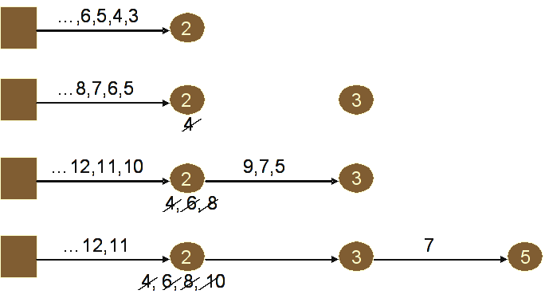

## Master 2 DL - PCR - Introduction à Akka

### Préliminaire

1. Mettez dans vos favoris le lien vers la [documentation de Akka](http://doc.akka.io/docs/akka/2.4.4/java.html).
2. Récupérez le projet "intro-akka" et importez le comme projet Maven dans IntelliJ.
3. Étudiez le fichier "pom.xml" et explorez la structure du projet.

### Partie 1 - Hello World revisité avec les acteurs

#### Exercice 1.1

1. Étudiez le contenu du package "m2dl.pcr.akka.helloworld1".
2. Éxécutez la classe "System" de ce package.
3. Étudiez le contenu du package "m2dl.pcr.akka.helloworld2".
4. Éxécutez la classe "System" de ce package. Comment expliquer le comportement du système observé ?
5. Étudiez le contenu du package "m2dl.pcr.akka.helloworld3".
6. Éxécutez la classe "System" de ce package. Expliquez le comportement du système observé :
    - que représentent les objets "hello" et "goodbye" ?
    - que permet de faire l'exécution de "getContext().unbecome()" ?
    - que signifie l'utilisation du deuxième paramètre de l'appel à "become" dans la définition de l'objet "hello" ?

#### Exercice 1.2

Dans un nouveau package, implémentez un système à 3 acteurs. L'acteur parent, lorsqu'il reçoit un message *msg*
correspondant à une chaîne de caractère, délègue en fonction de l'un de ses 2 comportements "hello" ou "goodbye"
l'affichage d'un message "Hello" ou "Good bye" à un de ses enfants respectivement spécialisé pour afficher
"Hello *msg* !" ou "Good bye *msg* !". Après chaque traitement de message, l'acteur parent change de comportement.

### Partie 2 - Crible d'Ératosthène

Rappel de l’algorithme vu en cours : les nombres premiers sont représentés par des acteurs qui forment une
chaîne et se passent les uns les autres les nombres en filtrant (« cribler ») ceux qui sont des multiples du nombre
qu’ils représentent. Chaque acteur a deux comportements possibles :
- soit l’acteur est en bout de chaîne et si le nombre qu’on lui envoie n’est pas filtré, alors il crée un acteur
représentant ce nombre pour étendre la chaîne avec celui-ci et change de comportement pour le second
afin de devenir un intermédiaire dans la chaîne ;
- soit l’acteur est un intermédiaire dans la chaîne et si le nombre qu’on lui envoi n’est pas filtré, alors il le
passe à l’acteur suivant dans la chaîne (dont il a mémorisé l’adresse car l’ayant créé).

1. Dans un nouveau package, implémenter cet algorithme de telle sorte que l’on puisse passer les nombres de 3 à N
(argument du programme) à un acteur représentant le nombre 2 que l’on aura créé auparavant.

2. À chaque fois qu’un nombre premier sera trouvé, il faudra l’afficher.

3. Modifier le programme pour terminer en chaîne l’exécution des acteurs une fois que tout les nombres ont
été envoyés.

### Partie 3 - Cryptage et contrôle d'erreur

En s’appuyant sur les méthodes disponibles dans la classe StringUtils fournie dans le package
"m2dl.pcr.akka.stringservices", définir et implémenter dans ce même package une application dans laquelle cohabitent
un service de cryptage CryptageProvider et un service d’ajout de contrôle d’erreur ErreurControleProvider pour des
chaînes de caractères.

Chaque service sera représenté par un acteur, leurs caractéristiques sont les suivantes :
- CryptageProvider reçoit des messages contenant une chaîne de caractères et l’adresse d’un acteur récepteur (Recepteur). Il
encrypte la chaîne de caractère et l’envoi à l’acteur Recepteur.
- ErreurControleProvider reçoit des messages contenant une chaîne de caractères et l’adresse d’un acteur récepteur (Recepteur).
Il ajoute un contrôle d’erreur à la chaîne de caractère et l’envoi à l’acteur Recepteur.

Ces services seront utilisé séparément (pour les tester individuellement) ainsi que composés. L’acteur Recepteur sera
susceptible de recevoir ces différents types de résultats (encrypté, avec contrôle d’erreur et composition).

Nous nous restreindrons aux 3 cas d’utilisation suivants :
- ActorSystem -> CryptageProvider -> Recepteur
- ActorSystem -> ErreurControleProvider -> Recepteur
- ActorSystem -> CryptageProvider -> ErreurControleProvider -> Recepteur

L’ActorSystem créera les différents services et le récepteur, et lancera ces 3 cas d’utilisation.
ATTENTION! Bien sûr, l’émetteur (ActorSystem) ne devra pas faire la composition lui-même pour ne pas être bloqué en
attente du résultat intermédiaire de la composition.

### Partie 4 - Cryptage et contrôle d'erreur en mode distribué

L'objectif de cette partie est d'illustrer les capacités de Akka pour la gestion d'acteurs distribués (*remote capabilities*).
Deux liens utils pour mener à bien votre travail :
- [Documentation Akka sur les aspects *remoting*](http://doc.akka.io/docs/akka/2.4.4/java/remoting.html)
- [L'exemple fourni par le projet Akka sur Github](https://github.com/akka/akka/tree/master/akka-samples/akka-sample-remote-java)

Reprendre le 3ème cas d'utilisation de la partie 3 (composition) de telle sorte que votre application déployée dans une VM
dédiée exploite les acteurs CryptageProvider et ErreurControleProvider déployés chacun sur une VM dédiée.

